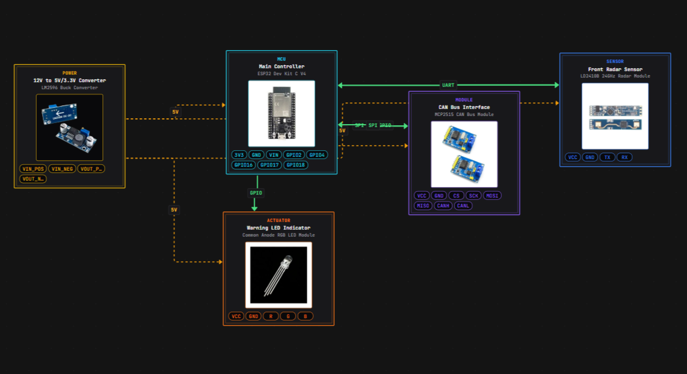

# Dashcam Forward Collision Warning – YOLOv8n & OpenCV

Sistem simulasi **peringatan tabrakan depan (Forward Collision Warning)** berbasis webcam laptop, menggunakan **YOLOv8n** (pretrained COCO) dan **OpenCV**, tanpa proses training ulang. Cocok untuk penelitian, skripsi, atau prototipe FCW.

---

## Deskripsi Sistem

Sistem ini menangkap video real-time dari webcam, mendeteksi kendaraan (mobil, bus, truk, sepeda motor) dengan YOLOv8n, lalu menganalisis ukuran dan perubahan ukuran bounding box antar frame. Dari sini ditentukan status **SAFE**, **CAUTION**, atau **WARNING**. Jika objek besar dan mendekat cepat, sistem menampilkan peringatan visual (dan opsional suara) untuk simulasi peringatan tabrakan.

**Fitur utama:**

- Deteksi hanya class kendaraan: `car`, `bus`, `truck`, `motorcycle`
- Perhitungan area bbox dan delta area antar frame
- Tiga status: SAFE (hijau), CAUTION (kuning), WARNING (merah) + teks "WARNING: Possible Collision!"
- FPS counter dan cooldown alert 2 detik
- Optimasi untuk CPU (tanpa GPU)

---

## Arsitektur

```
Webcam
   ↓
OpenCV (Frame Capture)
   ↓
YOLOv8n Detection (Pretrained COCO)
   ↓
Filter Class Kendaraan (car, bus, truck, motorcycle)
   ↓
Hitung Bounding Box Area
   ↓
Hitung Delta Area (perubahan antar frame)
   ↓
Collision Logic Analysis
   ↓
Alert System (Visual + Optional Sound)
   ↓
Display Output (FPS + Status)
```

---

## Workflow Visual

<p align="center">
  
</p>

---

## Cara Install

1. **Clone atau download** proyek ini.

2. **Buat virtual environment (disarankan):**
   ```bash
   python -m venv venv
   venv\Scripts\activate
   ```

3. **Install dependency:**
   ```bash
   pip install -r requirements.txt
   ```
   Model `yolov8n.pt` akan diunduh otomatis saat pertama kali menjalankan program.

4. **(Opsional)** Untuk alert suara, letakkan file `alert.wav` di folder `assets/sounds/`. Jika file tidak ada, sistem tetap berjalan tanpa suara.

---

## Cara Menjalankan

Jalankan dari **root proyek** (`C:\DashcamYOLO`):

```bash
python YOLO/main.py
```

- Tekan **`q`** di jendela kamera untuk keluar.
- Pastikan webcam tidak dipakai aplikasi lain. Jika kamera gagal terbuka, periksa index kamera di `YOLO/config.py` (`CAMERA_INDEX`).

---

## Struktur Folder

```
DashcamYOLO/
├── YOLO/
│   ├── main.py           # Entry point, loop webcam & integrasi
│   ├── detector.py       # Load YOLOv8n, detect(), filter kendaraan
│   ├── collision_logic.py# Area, delta area, status SAFE/CAUTION/WARNING
│   ├── alert.py          # Gambar bbox, teks status, warning, sound
│   └── config.py         # Threshold, cooldown, resolusi, class, warna
├── documentary/
│   └── workflow.png      # Diagram alur sistem
├── assets/
│   └── sounds/
│       └── alert.wav     # (opsional) file suara peringatan
├── logs/
├── requirements.txt
├── README.md
└── .gitignore
```

---

## Konsep Collision Logic

- **Area** = `width × height` bounding box (pixel²). Objek yang lebih dekat ke kamera tampak lebih besar (area lebih besar).
- **Delta area** = `area_sekarang - area_frame_sebelumnya`. Delta positif besar berarti objek mendekat cepat.
- **SAFE**: area kecil (objek jauh).
- **CAUTION**: area sedang atau delta sedang (mulai waspada).
- **WARNING**: area besar **dan** delta meningkat cepat → potensi tabrakan, sistem menampilkan peringatan merah dan (opsional) memutar suara.

Threshold area dan delta bisa diatur di `YOLO/config.py` (`AREA_SAFE_MAX`, `AREA_CAUTION_*`, `DELTA_*`).

---

## Konfigurasi

Semua parameter utama ada di **`YOLO/config.py`**:

| Parameter | Deskripsi |
|-----------|-----------|
| `FRAME_WIDTH`, `FRAME_HEIGHT` | Resolusi capture (default 640×480) |
| `CONFIDENCE_THRESHOLD` | Minimum confidence deteksi YOLO |
| `AREA_SAFE_MAX`, `AREA_CAUTION_*` | Batas area untuk SAFE/CAUTION |
| `DELTA_SAFE_MAX`, `DELTA_WARNING_MIN` | Batas delta area |
| `ALERT_COOLDOWN_SECONDS` | Cooldown suara peringatan (detik) |
| `SOUND_ENABLED`, `SOUND_PATH` | Aktif/nonaktif suara dan path file |

---

## Cara Upgrade Sistem

- **Training custom:** Ganti `MODEL_PATH` di `config.py` ke model `.pt` hasil training Anda, dan sesuaikan `VEHICLE_CLASS_IDS` jika class berubah.
- **GPU:** Set `DEVICE = "cuda"` di `config.py` jika tersedia CUDA.
- **Resolusi lebih tinggi:** Naikkan `FRAME_WIDTH`/`FRAME_HEIGHT` (perhatikan FPS).
- **Logging:** Tambahkan penulisan log ke folder `logs/` dari `main.py` atau modul terpisah (timestamp, status, FPS).
- **Tracking:** Untuk delta area per-objek yang lebih stabil, bisa ditambah tracker (e.g. ByteTrack) agar ID objek konsisten antar frame.

---

## Requirement

- Python 3.8+
- Webcam
- `ultralytics`, `opencv-python`, `numpy`, `playsound` (lihat `requirements.txt`)

---

## Lisensi & Penelitian

Proyek ini dapat digunakan untuk keperluan akademik dan penelitian. Sebutkan YOLOv8 (Ultralytics) dan sumber lain sesuai kebijakan kampus/penelitian Anda.
